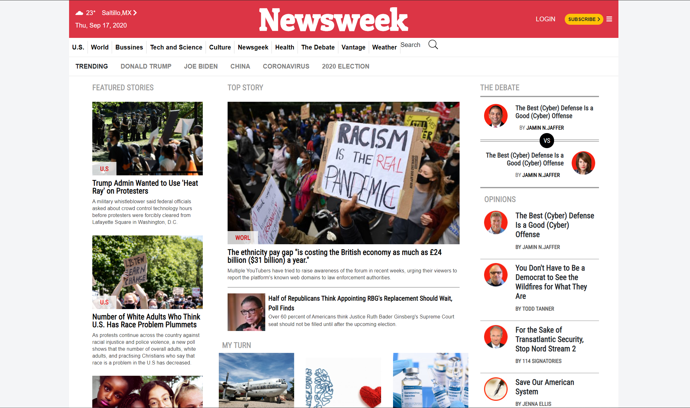

# Newsweek-Responsive-Clone

It is a clone from Newsweek home page but including fully responsive design. One very important requisite for this project was the use of bootstrap as more as possible, which was a great opportunity to learn how this usefull tool works. It was built from mobile-size to xl-size. The most responsive design happens inside the following ranges 320px 768px 1024px 1044px.

## Built With

- HTML
- CSS
- Bootstrap

## Live Demo

[Live Demo Link](https://alansoto31.github.io/Newsweek-Responsive-Clone/)

## Prerequisites 

- Chrome browser

## Set up

 - $ cd "folder location"
 - $ git clone git@github.com:AlanSoto31/Newsweek-Responsive-Clone.git
* Install
* Usage 
* Deployment 

## Authors

👤 **Alan Soto** 

- Github: [@AlanSoto31](https://github.com/AlanSoto31)
- Twitter: [@Alan95081574](https://twitter.com/Alan95081574)
- Linkedin: [linkedin Profile](https://www.linkedin.com/in/alan-soto-valle-b9a0511aa/)

👤 **Alan Soto** 

- Github: [@NataJenkins](https://github.com/NataJenkins)
- Twitter: [@NataJenkins](https://twitter.com/NataJenkins)
- Linkedin: [linkedin Profile](https://www.linkedin.com/in/natalia-macias-a11a20187/)

 ## Show your support

- Give a ⭐️ if you like this project!

## Acknowledgments

- Inspired on the Newsweek web site.
https://www.newsweek.com/
